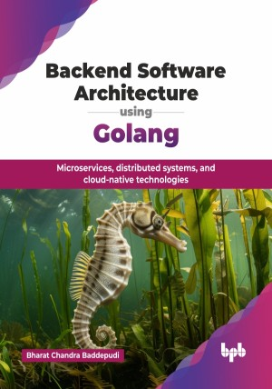

# Backend Software Architecture using Golang

Microservices, distributed systems, and cloud-native technologies.

This is the repository for [Backend Software Architecture using Golang
](https://bpbonline.com/products/backend-software-architecture-using-golang?variant=44380984279240),published by BPB Publications.

## About the Book
As AI-driven systems evolve, robust backends are vital for managing large-scale data. This book explores backend principles, focusing on Go (Golang) for scalable, cloud-native development. It highlights Go’s readability, concurrency, and open-source support. Step-by-step guidance, design patterns, and examples help developers and architects create resilient systems for modern software applications.

It starts with the basics of backend development, covering programming, databases, APIs, and cloud services. You will learn Go fundamentals like data structures, packages, and testing, followed by using frameworks like Gin and Echo for web servers. It introduces microservices, Docker, Kubernetes, and concepts like concurrency and fault tolerance. You will explore inter-service communication (REST, gRPC, GraphQL), data modeling with relational and NoSQL databases, and scalability. The book also dives into CI/CD, cloud deployment, monitoring, security best practices, and strategies for maintaining backend systems efficiently.

By mastering the concepts and practices covered in this book, you will be well-equipped to design, develop, and deploy secure, scalable, and maintainable backend systems using Golang. You will gain the confidence to tackle complex backend challenges and contribute to the development of high-performance applications.

## What You Will Learn
• Core Go language constructs and concurrency patterns for efficient programming.

• Building high-performance web servers using popular Go frameworks.

• Designing microservices and orchestrating containers with Kubernetes for scalability.

• Creating secure and scalable APIs with RESTful, gRPC, and GraphQL.

• Best practices for CI/CD pipelines and robust backend system optimization.

• Use industry standard techniques that can instill confidence in stakeholders as well as users/customers.
